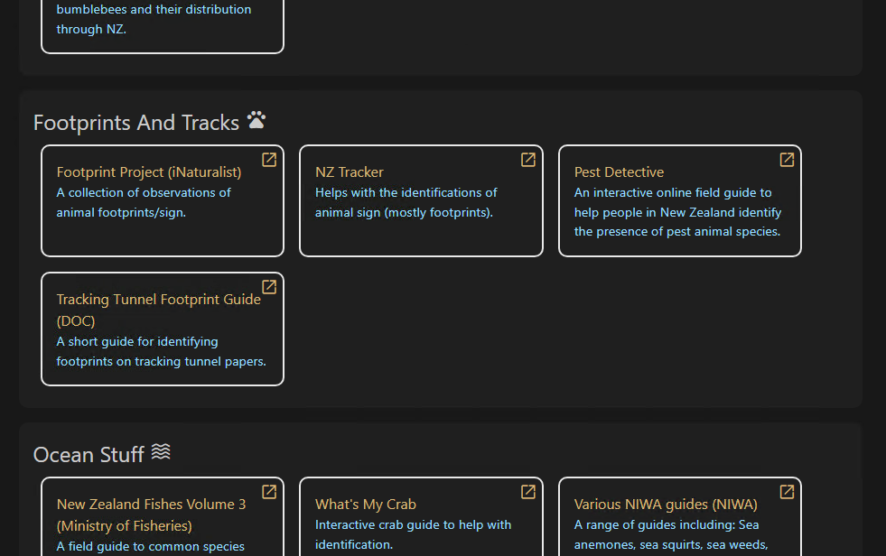
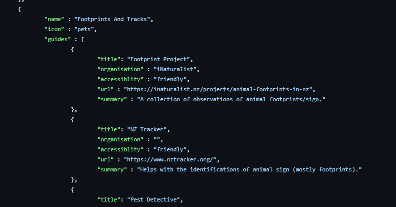

# NZ Guides

This is a collection of guides to help with identifying animals/plants etc - can be found here: https://nzguides.vercel.app/

It looks something like this:

This is created by a JSON file in guides/src/data/guideData.json, so you can add stuff to it if you want. It looks kind of like this:

